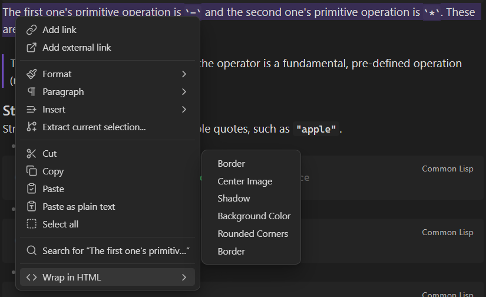

# HTML Markdown Wrapper

## TODOs

- [X] Add Checker for empty fields.
- [X] Modal to ask if you wanna remove the HTML tags of the selection.
  - [X] Check if the selection contains HTML tags
- [ ] Edit and Delete category from Settings Menu
  - [ ] Edit
  - [X] Delete
- [ ] Edit and Delete Items from Settings Menu
  - [X] Edit
  - [ ] Delete
- [ ] Fix the Hover bug in the SubMenu
