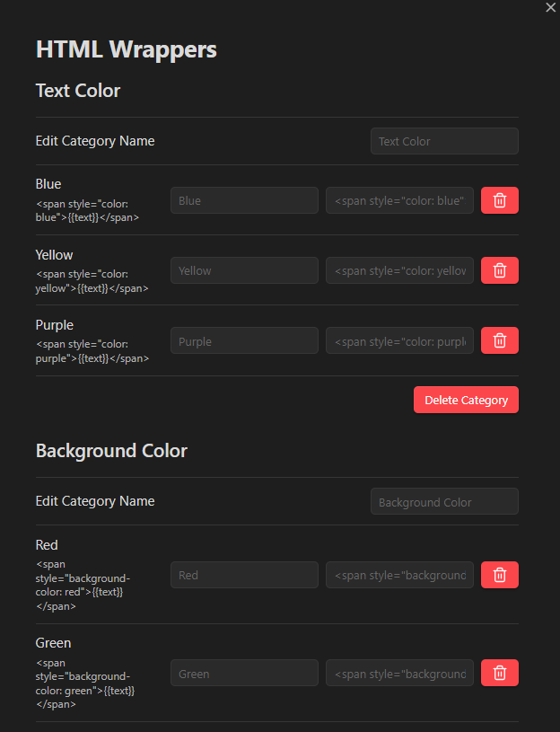

# HTML Markdown Wrapper

## Introduction

This is an Obsidian plugin designed to quickly wrap text in HTML tags without the need for repetitive manual typing.

## How To Use

1. Click the icon to create the Wrapper


2. Type the information related to the HTML Wrapper


- Category: category under which you wanna group the wrapper, for example "color" or "outline";
- Name: name of the wrapper, for example "red text", "white border";
- Content: the HTML template to use, with {{}} as the placeholder for the selected text, as:

```html
<span style="color: purple">{{}}</span>
```

If it's an image, it should be like this:

```html

```

>It checks for invalid HTML.

3. Select the Wrapper

You select the text you want to wrap your HTML tags around and right click to display the menu:


4. Apply the Wrap

If the selection already contains a HTML tag, it will ask you if you wanna remove the existing HTML tag before applying the newly selected one:


## Settings Menu

The setting menu allows you to manage your categories and tags:

- Category:
  - Edit a category name;
  - Delete the category (it deletes the items that belong to it as well, obviously).
- Items:
  - Edit and Delete single items.



## Note

The plugin comes with a file [`constants.ts`](./Helpers/constants.ts) that already contains some predefined tags.
